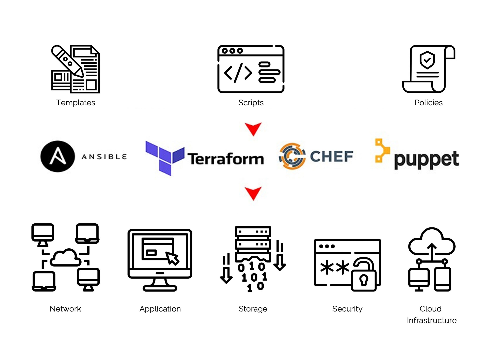
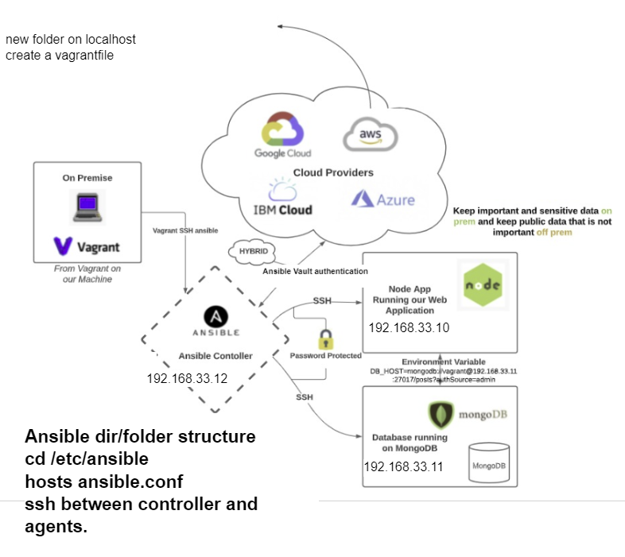
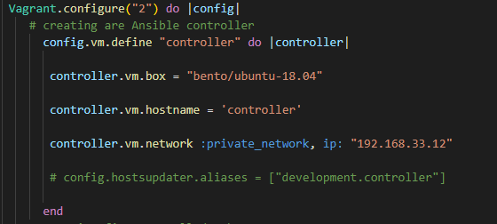
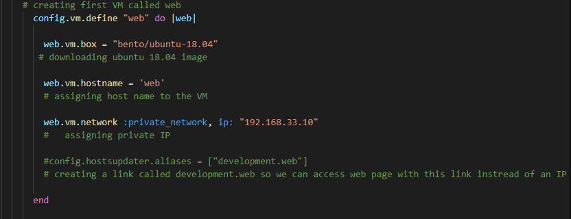
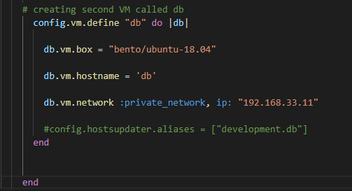
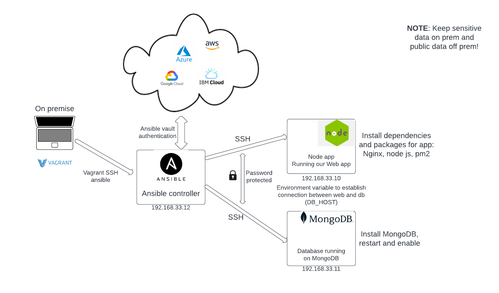
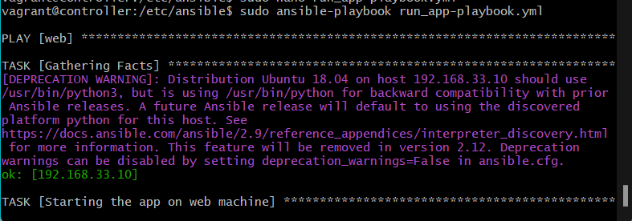
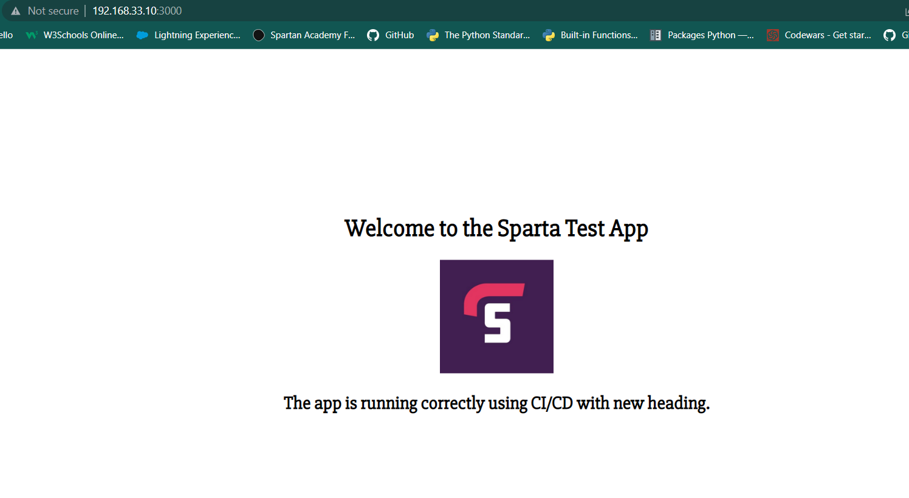

# Infrastructure as Code(IaC)

## What is IaC ? 

IaC is a way of managing a computer infrastructure using code instead of manual processes. 
This means that instead of manually setting up servers, networks and other resources, you define them in code which can then be automatically deployed and configured. 

## Why do we use it ? 

- Automates infrastructure provisioning and configuration
- Ensures consistency across different environments
- Enables scalability and flexibility
- Provides version control for infrastructure definitions
- Reduces chances of human error
- Infrastructure is more manageable and maintanable over time. 


## Configuration management

Configuration management is the process of managing the configuration of an organization's IT infrastructure. 

It involves tasks such as tracking changes, documenting items, and ensuring consistency across environments. It is important for reliability, security, and issue resolution.

## Orchestration

Orchestration automates and coordinates complex workflows across multiple systems or applications, making it easier to deploy and manage applications at scale.


## Tools used in IaC

- Terraform: A tool for declarative infrastructure provisioning across cloud providers and services.

- AWS CloudFormation: A tool for infrastructure provisioning using templates to define resources and dependencies in AWS.

- Ansible: A tool for automating infrastructure configuration management and deployment across systems and environments.

- Puppet: A tool for automating the configuration and management of infrastructure components across systems and environments.

- Chef: In IaC, Chef is typically used to define infrastructure and application configurations as code, which can be version-controlled and shared across teams. This allows more consistent and repeatable deployments and reduces the potential for human error. 




---


## Who is using IaC ?

- Airbnb: Uses IaC to manage cloud infrastructure and automate resource provisioning.

- Netflix: Uses IaC to manage cloud infrastructure and automate application deployment.

- Capital One: Uses IaC to manage hybrid cloud environment and automate resource provisioning.

- GitHub: Uses IaC to manage cloud infrastructure and automate application deployment.

- NASA: Uses IaC to manage IT infrastructure and automate resource deployment and configuration.


# Terraform

Terraform is an open-source infrastructure as code software tool that enables you to safely create, change, and improve infrastructure and it is used primarily by DevOps teams to automate various infrastructure tasks.


# Ansible 

Ansible is a software tool that provides simple but powerful automation for cross-platform computer support.

Ansible doesn't depend on agent software and has no additional security infrastructure, so it's easy to deploy.

**Agent software** typically refers to a piece of software that runs on a target system or device and is responsible for collecting and sending data back to a central management system. 

## Ansible VS Terraform

While both Ansible and Terraform are used for infrastructure automation,
Ansible is mainly focused on configuration management, while Terraform is primarily focused on infrastructure provisioning and management.

Depending on your specific needs, you may choose one tool over the other or use both in conjunction to achieve your automation goals. 


## Push configuration vs pull configuration

The main difference between the two methods is how the servers are configured. In the **pull method**, the to be configured server pulls its configuration from the controlling server whereas the **push method**, the controlling server pushes the configuration to the destination system.


---

# Ansible architecture guide step.1




- Create a `vagrantfile` in VS code and import the script to create 3 VMs using oracle.

```
# -*- mode: ruby -*-
 # vi: set ft=ruby :
 
 # All Vagrant configuration is done below. The "2" in Vagrant.configure
 # configures the configuration version (we support older styles for
 # backwards compatibility). Please don't change it unless you know what
 
 # MULTI SERVER/VMs environment 
 #
 Vagrant.configure("2") do |config|
    # creating are Ansible controller
      config.vm.define "controller" do |controller|
        
       controller.vm.box = "bento/ubuntu-18.04"
       
       controller.vm.hostname = 'controller'
       
       controller.vm.network :private_network, ip: "192.168.33.12"
       
       # config.hostsupdater.aliases = ["development.controller"] 
       
      end 
    # creating first VM called web  
      config.vm.define "web" do |web|
        
        web.vm.box = "bento/ubuntu-18.04"
       # downloading ubuntu 18.04 image
    
        web.vm.hostname = 'web'
        # assigning host name to the VM
        
        web.vm.network :private_network, ip: "192.168.33.10"
        #   assigning private IP
        
        #config.hostsupdater.aliases = ["development.web"]
        # creating a link called development.web so we can access web page with this link instread of an IP   
            
      end
      
    # creating second VM called db
      config.vm.define "db" do |db|
        
        db.vm.box = "bento/ubuntu-18.04"
        
        db.vm.hostname = 'db'
        
        db.vm.network :private_network, ip: "192.168.33.11"
        
        #config.hostsupdater.aliases = ["development.db"]     
      end
    
    
    end
```


---
The script below creates the Ansible controller with Ubuntu 18.04 OS, and hard-coded IP address.





---


This script creates the "web" VM with the same OS but different IP address.





---


And lastly, this script creates the 2nd VM called "db". 





---

Now we run `vagrant up` in the terminal.


This should start up 3 machines in your Virtual Box
- controller
- web
- db


SSH into all of them in separate GitBash terminals and run these commands to establish connection and run updates and upgrades:

- `sudo apt-get update -y`
- `sudo apt-get upgrade -y`


Next in the controller VM we prepare Ansible to install.
```
 `sudo apt-add-repository ppa:ansible/ansible`
 `sudo apt-get install software-properties-common` 
 `sudo apt-get install ansible -y`
```
- Check the version`ansible --version`

- Then we can run `sudo apt-get update -y` to apply updates. 
`


**NOTE**: This is how we get into the "hosts" file.  
 ```
vagrant@controller:~$ cd /etc
vagrant@controller:/etc$ cd ansible/
vagrant@controller:/etc/ansible$ pwd
/etc/ansible
```

---

**Ping**:

Using `sudo ansible -m ping web` we can see if the machines are communicating between one another. At this present moment we should not be able to ping the web VM because we havent specified the web's and db's  IP address to our controller `hosts` file along with some other configuration as seen below. 

In order to be able to ping the ****web** VM will need to change some configurations. 

First we can double-check if we have the RSA key.
**RSA key location in web VM**:
- `ls -a`
- `cd .ssh`
- `ls`
- `sudo nano authorized_keys`
Here we can see that we have the RSA key. 


Edit the hosts file using `cd /etc/ansible` to navigate to the correct location of the hosts file in the **controller** and `sudo nano hosts` to edit the file to be able to ping the "web" machine. We will need to edit this file as instructed below.

 Dont forget to use the IP of web, as seen in the below code, specify the connection type->ssh, and the log in as well as the password. In this case it is `vagrant` for both for ease of use. 
```
[web]
192.168.33.10 ansible_connection=ssh ansible_ssh_user=vagrant ansible_ssh_pass=vagrant
```


Now if we would like to ping the web machine we will need to change some configuration of web machine.
To connect using ssh from controller to web we use `ssh vagrant@192.168.33.10`(IP is of the web VM).


**In the web VM:**
- `cd /etc`
- `ls`
- `cd ssh`
- `sudo nano sshd_config` 

We need to make sure these lines of code are uncommented:
- `PermitRootLogin prohibit-password`
- `PasswordAuthentication yes`
- `ChallengeResponseAuthentication no`

Now we will need to run `sudo systemctl restart ssh` for the changes to take effect.

Now we need to edit the `ansible.conf` file in the **controller VM**:
```
cd /etc/ansible
ls
sudo nano ansible.config
```
After [defaults] add this:

`host_key_checking = false`


Next in the controller we run `sudo ansible -m ping web` and the following should be the output if the previous configuration was successful:

```
192.168.33.10 | SUCCESS => {
    "ansible_facts": {
        "discovered_interpreter_python": "/usr/bin/python"
    },
    "changed": false,
    "ping": "pong"
}
```

---

 Useful `ad hoc` commands:

- `vagrant@controller:/etc/ansible$ sudo ansible web -a "uname -a"` gives info about the VM

- `sudo ansible all -a "date"` outputs time zone


- `sudo ansible all -a "free -m"` outputs free space available

- `sudo ansible all -a "ls -a"` to find hidden files

For more information and commands please click on this link -> [Ad hoc](https://docs.ansible.com/ansible/latest/command_guide/intro_adhoc.html)

---

If we would like to copy a file from the Ansible controller onto the web VM here are the steps:

1. Create a file in the controller `sudo nano test.txt` and write some content into it.

2. `sudo ansible web -m ansible.builtin.copy -a "src=test.txt dest=test.txt"`- This command specifies the source: "test.txt"m and the destination: "test.txt".

3. Next we can check in the web VM if the file has been copied over with the content. 


---

# Ansible architecture guide step.2



As we can see on the diagram above, now we will need to install the required dependencies, packages and database into our VMs. 

- Step1.- Install required dependencies on web(Nginx, pm2, node js) using playbook and shell script. 
- Step2.- Install mongoDB database on our db VM.
- Step3.- Establish the connection between web and db by implementing an environment variable.


[Linux commands for installing dependencies](https://github.com/MarekMatyas/tech201_virtualization)
 

We also need to make sure we configure the `mongodb.conf` file using `sudo nano /etc/mongodb.conf` and set the bindIP to `0.0.0.0`. 

After that we will need to `restart` and `enable` mongod. 

---

**NOTE**: To achieve communication between our web and db VM's, we will need to create an environment variable on our web VM using `export DB_HOST=mongodb://192.168.33.11:27017/posts` with the IP of our db.

---


## Step 1.


- `sudo nano nginx-playbook.yml`
Create a playbook to configure Nginx web server in web machine

`---` to start a YAML file

```
# Create a playbook to configure Nginx web server in web machine

# Let's add --- 3 dashes to start a YAML file
---


# Where do we want this playbook to run
# Add the name of the host
- hosts: web
# Find the facts
  gather_facts: yes
# We need admin access
  become: true


# Now that we have access, we can start adding instructions to perform the task
# Install nginx in web machine
  tasks:
  - name: Install Nginx in web-server
    apt: pkg=nginx state=present
# Ensure that nginx is running - status is running
```


- `sudo ansible-playbook nginx-playbook.yml` to run the file 

- `sudo ansible web -a "systemctl status nginx"` to check the status of nginx

Check functionality insert the IP address of web VM. 

---

### Node, npm, pm2 

First we will need to copy our app script into the "web" machine. 

There are multiple ways of doing, and in this particular task we will be using the method of cloning from our repository.

We need to make sure we create our playbooks in the `/etc/ansible` directory.

First we need to create a directory in our web VM to store the cloning content. In this case we called it `task_repo`.

Then in our controller we can create a playbook called `clone_app`.

- `sudo nano clone_app-playbook.yml`

```
---
# Creating a playbook to clone GitHub repository where our our script for app is located

---
# What we would like to name this playbook
- name: Clone repository
# Where we want to clone this repo
  hosts: web
  tasks:
    - name: Clone repository
      git:
        repo: https://github.com/MarekMatyas/tech201_virtualization.git
        dest: /home/vagrant/task_repo

```

**NOTE**: 
- name of the task is "Clone repository"
- repo is the URL of the repository
- dest is the destination where want to clone the repo


Now if we would like to run this playbook we do this using `sudo ansible-playbook clone_app-playbook.yml`

---

Next we will need create another playbook called `pm2` using `sudo nano.

---

**Possible blocker at this stage**:


If we would like to install node and pm2, this may cause problem due to the pm2 may have issues with the version of node. We need to make sure that we install node version 10. and above as seen in the script below. 

---

The content for this playbook should be as follows:

```
# Playbook to configure npm, pm2, nodejs using shell script

---

# where do we want this playbook to run
# add the name of the host
- hosts: web
# Check the ping


# find the facts
  gather_facts: yes


# we need admin access
  become: true

# Now that we can the access, we can add the instructions to perform the task
  tasks:
  - name: Install NPM
    shell: |
      #!/bin/bash
      curl -sL https://deb.nodesource.com/setup_12.x | sudo -E bash -
      sudo apt-get install nodejs -y
      sudo npm install pm2 -g
```

**NOTE**- In this particular playbook we are using a shell script to install some dependencies such as node v12 and pm2. 

To indicate the shell script we use `|` symbol to specify that anything below that symbol is a shell script. 

Now to run this playbook we use the same command as before `sudo ansible-playbook pm2-playbook.yml`

--- 


Now we can move onto making a playbook called "run_app-playbook.yml" that will run the app for us.

To create a playbook we use `sudo nano run_app-playbook.yml`

We need to make sure that we use more accessible directory when writing the script for the playbook to be ran in the web VM. (home/task_repo/app). If we encounter a problem in this area, we can copy the entire app folder where we have our app script to more suitable location. 

```
# create a playbook to run app in web machine

# let`s add --- 3 dashes  to start a YAML file

---

# where do we want this playbook to run
# add the name of the host
- hosts: web
# this will check the ping


# find the facts
  gather_facts: yes
# yes can also be replaced with true


# we need admin access
  become: true

# we have the admin acess, now we can add the instructions to perform the task
# getting the app running on web machine
  tasks:
  - name: Starting the app on web machine
    shell: |
      #!/bin/bash
      cd /home/task_repo/app
      npm install
      pm2 kill
      pm2 start app.js


# this command will start the app and run it on the background


```


Notice we are using shell script(#!/bin/bash) again to:
- Navigate into the correct directory `cd /home/task_repo/app`
- Install npm `npm install`
- `pm2 kill` and `pm2 start app.js` to start the app and run it on the background so we won't be locked out of the terminal. 

To run the this playbook we use `sudo ansible-playbook run_app-playbook.yml`

If all previous configuration has been success then this should be our output:




Next we can check if the app is actually up and running by using the web VM's IP in the browser with the port 3000 because at this stage the reverse proxy has not been configured. 



---

### DB(Database) part of the architecture:

We need to connect into the controller first. 

We create another playbook called "mongod" `sudo nano mongodb-playbook.yml` using this command

The Yaml file below is how we configure the playbook to install mongoDB. 

```
# Create a playbook to configure/install mongodb in our DB machine

# name of the hosts/node
---
- hosts: db

# let's find the facts
  gather_facts: yes

# We will need admin access
  become: true

# Now that we have access we can start adding the instructions to perform the tasks

  tasks:
  - name: Install mongodb most latest version
    apt: pkg=mongodb state=present

# Status available/running
```

Before we run this playbook we will need to configure `hosts` file because as soon as we run this playbook, it will go to the `hosts` file to check the connection of db IP for communication.

So let's add the db VM's IP to our "hosts" file located in our controller VM in `/etc/ansible` location the same way we did for the web VM previously for the machines to be able to communicate. 

```
[db]
192.168.33.11 ansible_connection=ssh ansible_ssh_user=vagrant ansible_ssh_pass=vagrant
```

After we save the `hosts` file we should be anle to run the playbook. `sudo ansible-playbook mongodb-playbook.yml`

To check the status of the playbook we just ran we use `sudo ansible db -a "systemctl status mongodb"` and this sends a request to our db machine and install mongoDB.


**Quick note**: Whenever we do `vagrant reload` there is a specific file full with dependecies that vagrant is pulling information from. That is located in our local host and we can display it by using `ls -a` to display hidden files and look for `vagrant` file. 


Next we need to change configuration of mongodb.conf  and we will need to check the bindIP and make sure that that port is correct too. 

We can do so from our controller using `ssh vagrant@192.168.33.11` which if the IP of db machine. 

Once we are inside the db machine we navigate into `mongod.conf` using `cd /etc` -> `sudo nano mongodb.conf`

What we will have to change is as follows to open this for everyone:

```
bind IP- 0.0.0.0
uncomment port = 27017
```


Lastly we save the file and run these commands for changes to take effect:

```
sudo systemctl restart mongodb
sudo systemctl enable mongodb
```

---

Next we can move onto the **environment variable.**

If all proccesses previously were successful, we need to create env var in the web VM for the connection between web and db to be able to populate the app with posts. 

We can do this by creating another playbook called "env_var-playbook.yml" using `sudo nano env_var-playbook.yml`

```

# This playbook is for creating an environment variable

# --- to start the YAML file
---
# Where do we want this playbook to run
# Add the name of the host(web)
- hosts: web
# Find the facts
  gather_fact: yes
# Gain admin access
  become: yes
# Now that we have access, we can start writting the instructions to perform this task:
  tasks:
  - name: Environment variable
    shell: echo 'DB_HOST="mongodb://192.168.33.11:27017/posts"' >> ~/.bashrc && source .bashrc
    args:
      executable: /bin/bash
```


---

# Automating creating EC2 instance


Now we can attempt to automate process of creating EC2 using a playbook.

We will need: 
- generate ssh key pair .pem using `ssh-keygen -t rsa -b 4096 -f ~/.ssh/devops_tech201`, This will generate `.pem` file with private and public key that will be created in the `.ssh` directory where we store all of our keys. 

---

- We will also need to instal certain dependecies and packages that AWS requires:
```
sudo apt install python3-pip 
alias python=python3
pip3 install awscli
pip3 install boto3
```
The way we can check if we have the right version we can use `python --version` and this needs to be version 3 and above. In terms of the `boto3` we can use the pip package manager to display the vesion of boto3 using `pip3 show boto3`. 

---

**ansible-vault**. Ansible vault is where we import our aws access and secret keys where we set a password for more security. 


- `sudo apt install tree` for more aesthetically pleasing folder structure.
- `tree` to display a tree of folders
- `sudo mkdir group_vars` to create a folder called "group_vars"
- navigate into that group_vars folder using `cd`
- create a folder called "all" `mkdir all` then type `tree` to display that folder
- `cd` into all folder 
-  This should be your folders structure: `/etc/ansible/group_vars/all$`


- `sudo ansible-vault create pass.yml` - create the file called "pass.yml" where we put the access and secret keys provided to us previously. It might ask for password which in this case is "vagrant" for ease of use. 

In there we import the keys mentioned earlier in this fashion:

- aws_access_key: "import access key"
- aws_secret_key: " import secret key"
to save we use `ESC` -> `:wq` -> `Enter`

Side note:
- `sudo ansible-vault edit pass.yml` to edit the previously created file 


Here is a template of playbook used for creating an EC2 instance:

**NOTE**: Remember to edit the variables the way that is related to your case! 

```
# AWS playbook
---

- hosts: localhost
  connection: local
  gather_facts: False

  vars:
    key_name: my_aws
    region: us-east-2
    image: ami-0f93b5fd8f220e428 # https://cloud-images.ubuntu.com/locator/ec2/
    id: "web-app"
    sec_group: "{{ id }}-sec"

  tasks:

    - name: Facts
      block:

      - name: Get instances facts
        ec2_instance_facts:
          aws_access_key: "{{aws_access_key}}"
          aws_secret_key: "{{aws_secret_key}}"
          region: "{{ region }}"
        register: result

      - name: Instances ID
        debug:
          msg: "ID: {{ item.instance_id }} - State: {{ item.state.name }} - Public DNS: {{ item.public_dns_name }}"
        loop: "{{ result.instances }}"

      tags: always


    - name: Provisioning EC2 instances
      block:

      - name: Upload public key to AWS
        ec2_key:
          name: "{{ key_name }}"
          key_material: "{{ lookup('file', '/your/path/to/.ssh/{{ key_name }}.pub') }}"
          region: "{{ region }}"
          aws_access_key: "{{aws_access_key}}"
          aws_secret_key: "{{aws_secret_key}}"

      - name: Create security group
        ec2_group:
          name: "{{ sec_group }}"
          description: "Sec group for app {{ id }}"
          # vpc_id: 12345
          region: "{{ region }}"
          aws_access_key: "{{aws_access_key}}"
          aws_secret_key: "{{aws_secret_key}}"
          rules:
            - proto: tcp
              ports:
                - 22
              cidr_ip: 0.0.0.0/0
              rule_desc: allow all on ssh port
        register: result_sec_group

      - name: Provision instance(s)
        ec2:
          aws_access_key: "{{aws_access_key}}"
          aws_secret_key: "{{aws_secret_key}}"
          key_name: "{{ key_name }}"
          id: "{{ id }}"
          group_id: "{{ result_sec_group.group_id }}"
          image: "{{ image }}"
          instance_type: t2.micro
          region: "{{ region }}"
          wait: true
          count: 1
          # exact_count: 2
          # count_tag:
          #   Name: App
          # instance_tags:
          #   Name: App

      tags: ['never', 'create_ec2']
```

---
- to run the aws_playbook we use this command to ask for password and to create an EC2 instance `ansible-playbook playbook.yml --ask-vault-pass --tags create_ec2`
---

Lastly, we can check on AWS if the EC2 instance has been launched. 
 


