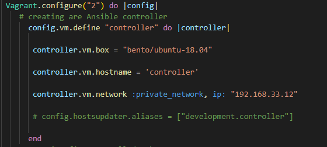
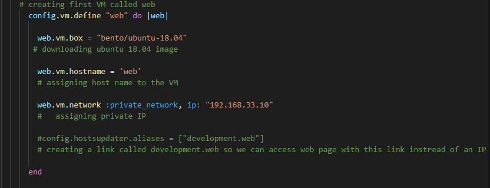
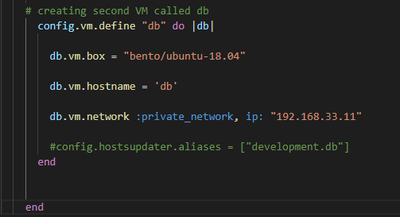

# Infrastructure as Code(IaC)

## What is IaC ? 

IaC is a way of managing a computer infrastructure using code instead of manual processes. 
This means that instead of manually setting up servers, networks and other resources, you define them in code which can then be automatically deployed and configured. 

## Why do we use it ? 

- Automates infrastructure provisioning and configuration
- Ensures consistency across different environments
- Enables scalability and flexibility
- Provides version control for infrastructure definitions
- Reduces chances of human error
- Infrastructure is more manageable and maintanable over time. 


## Configuration management

Configuration management is the process of managing the configuration of an organization's IT infrastructure. 

It involves tasks such as tracking changes, documenting items, and ensuring consistency across environments. It is important for reliability, security, and issue resolution.

## Orchestration

Orchestration automates and coordinates complex workflows across multiple systems or applications, making it easier to deploy and manage applications at scale.


## Tools used in IaC

- Terraform: A tool for declarative infrastructure provisioning across cloud providers and services.

- AWS CloudFormation: A tool for infrastructure provisioning using templates to define resources and dependencies in AWS.

- Ansible: A tool for automating infrastructure configuration management and deployment across systems and environments.

- Puppet: A tool for automating the configuration and management of infrastructure components across systems and environments.

- Chef: In IaC, Chef is typically used to define infrastructure and application configurations as code, which can be version-controlled and shared across teams. This allows more consistent and repeatable deployments and reduces the potential for human error. 


---


## Who is using IaC ?

- Airbnb: Uses IaC to manage cloud infrastructure and automate resource provisioning.

- Netflix: Uses IaC to manage cloud infrastructure and automate application deployment.

- Capital One: Uses IaC to manage hybrid cloud environment and automate resource provisioning.

- GitHub: Uses IaC to manage cloud infrastructure and automate application deployment.

- NASA: Uses IaC to manage IT infrastructure and automate resource deployment and configuration.


# Terraform

Terraform is an open-source infrastructure as code software tool that enables you to safely create, change, and improve infrastructure and it is used primarily by DevOps teams to automate various infrastructure tasks.


# Ansible 

Ansible is a software tool that provides simple but powerful automation for cross-platform computer support.

Ansible doesn't depend on agent software and has no additional security infrastructure, so it's easy to deploy.

**Agent software** typically refers to a piece of software that runs on a target system or device and is responsible for collecting and sending data back to a central management system. 

## Ansible VS Terraform

While both Ansible and Terraform are used for infrastructure automation,
Ansible is mainly focused on configuration management, while Terraform is primarily focused on infrastructure provisioning and management.

Depending on your specific needs, you may choose one tool over the other or use both in conjunction to achieve your automation goals. 


## Push configuration vs pull configuration

The main difference between the two methods is how the servers are configured. In the **pull method**, the to be configured server pulls its configuration from the controlling server whereas the **push method**, the controlling server pushes the configuration to the destination system.


---

# Guide


- Create a `vagrantfile` in VS code and import the script to create 3 VMs using oracle.

```
# -*- mode: ruby -*-
 # vi: set ft=ruby :
 
 # All Vagrant configuration is done below. The "2" in Vagrant.configure
 # configures the configuration version (we support older styles for
 # backwards compatibility). Please don't change it unless you know what
 
 # MULTI SERVER/VMs environment 
 #
 Vagrant.configure("2") do |config|
    # creating are Ansible controller
      config.vm.define "controller" do |controller|
        
       controller.vm.box = "bento/ubuntu-18.04"
       
       controller.vm.hostname = 'controller'
       
       controller.vm.network :private_network, ip: "192.168.33.12"
       
       # config.hostsupdater.aliases = ["development.controller"] 
       
      end 
    # creating first VM called web  
      config.vm.define "web" do |web|
        
        web.vm.box = "bento/ubuntu-18.04"
       # downloading ubuntu 18.04 image
    
        web.vm.hostname = 'web'
        # assigning host name to the VM
        
        web.vm.network :private_network, ip: "192.168.33.10"
        #   assigning private IP
        
        #config.hostsupdater.aliases = ["development.web"]
        # creating a link called development.web so we can access web page with this link instread of an IP   
            
      end
      
    # creating second VM called db
      config.vm.define "db" do |db|
        
        db.vm.box = "bento/ubuntu-18.04"
        
        db.vm.hostname = 'db'
        
        db.vm.network :private_network, ip: "192.168.33.11"
        
        #config.hostsupdater.aliases = ["development.db"]     
      end
    
    
    end
```


---
The script below creates the Ansible controller with Ubuntu 18.04 OS, and hard-coded IP address.




---

This script creates the "web" VM with the same OS but different IP address.


---

And lastly, this script creates the 2nd VM called "db". 




---

Now we run `vagrant up` in the terminal.


This should start up 3 machines in your Virtual Box
- controller
- web
- db


SSH into all of them in separate GitBash terminals and run these commands to establish connection and run updates and upgrades:

- `sudo apt-get update -y`
- `sudo apt-get upgrade -y`


Next in the controller VM we prepare Ansible to install.
```
 `sudo apt-add-repository ppa:ansible/ansible`
 `sudo apt-get install software-properties-common` 
```

- Then we can run `sudo apt-get update -y` to apply updates. 

 `sudo apt-get install ansible -y` to install and check the version`ansible --version`


**NOTE**: This is how we get into the "hosts" file.  
 ```
vagrant@controller:~$ cd /etc
vagrant@controller:/etc$ cd ansible/
vagrant@controller:/etc/ansible$ pwd
/etc/ansible
```

Edit the hosts file using `cd /etc/ansible` in the controller and `sudo nano hosts` to be able to ping the "web" machine.
- After "defaults" section we import this `host_key_checking = false` and save it.
 Dont forget to use the IP of web, specify the connection type->ssh, and the log in as well as the password. In this case it is `vagrant` for both for easy of use. 
```
[web]
192.168.33.10 ansible_connection=ssh ansible_ssh_user=vagrant ansible_ssh_pass=vagrant
```


Now if we would like to ping the web machine we will need to change some configuration of web machine.
To connect using ssh from controller to web we use `ssh vagrant@192.168.33.10`(IP is of the web VM)
In the web:
- `cd /etc/ssh`
- `sudo nano sshd_config`

We need to uncomment a few lines of code:
- `PermitRootLogin prohibit-password`
- `PasswordAuthentication yes`
- `ChallengeResponseAuthentication no`

After we run `sudo systemctl restart ssh`. 

- In the controller we run `sudo ansible -m ping web` and the following should be the output:

```
192.168.33.10 | SUCCESS => {
    "ansible_facts": {
        "discovered_interpreter_python": "/usr/bin/python"
    },
    "changed": false,
    "ping": "pong"
}
```


