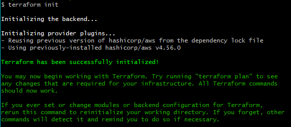

# Terraform 

## How it works ?

Terraform in orchestration tool in IaC(Infrastructure as code) owned by HashiCorp.

In simple terms, Terraform works by defining the desired state of your infrastructure in a configuration file, and then applying that configuration to you infrastructure. 

---

## Action plan:


---

## Set-up Guide

First things first we will need to download and install terraform.

***NOTE**: Make sure you use appropriate version for your system when downloading terraform. In our case it would be `AMD64` for Windows. 

To download, navigate to this link -> [Terraform download](https://developer.hashicorp.com/terraform/downloads)

To install it we will need to extract the file that has been downloaded and move the `.exe` file to newly created folder called "Terraform" in our `C:/`

To install terraform, there is a quick and simple step guide -> [Terraform install](https://www.youtube.com/watch?v=SkcRSJWNRS8). **Be sure to use this guide to install terraform only!**

- After we installed terraform, we can open GitBash terminal as ADMIN and type in `terraform --version` to confirm the successful installation.

This should be your output:

```
Terraform v1.3.9
on windows_amd64
```

We will need to create a `main.tf` file in the location of our choice for example: `C:\Users\matya\IaC_terraform` and this is where we put our instructions such as: Lauching EC2, Security groups, VPC and ASG(Auto-Scaling Group).

This file will be used to help deploy this infrastructure and with help of Ansible we will be able to configure this infrastructure. 

**NOTE**: If we don't use AMI for this main.tf file, the EC2 instance that will be launched, will be empty. 


In terms of the Load Balancers, VPC's and other set up, that is where Terraform come in play. We will need to turn these configurations into code. 


- **Environment variables guide**:

To upload AWS credentials we need follow these steps:

- In your windows search bar, type in "Edit the system environment variables"

- Go to advanced section and click on `Environment variables`

- From there click on `New` in the "User variables" section.

- Lastly, name your key ID's appropriately "AWS_ACCESS_KEY_ID", "AWS_SECRET_KEY", import the key values and be sure to double check the values and press `OK`.

Then we can open VS code and open the folder we created before for this task.

- Location: `C:\Users\matya\IaC_terraform`

Our folder structures should be like this:


Our script for `main.tf` will be written in **HCL(HashiCorp Configuration Language)** that is used for defining infrastructure as code using Terraform.

```

# launch ec2
# which cloud provider tp specify

provider "aws" {
    region = "eu-west-1"

}

resource "aws_instance" "app_instance" {
    ami = "ami-029d17cd5c8c4b76e"
    instance_type = "t2.micro" 
    associate_public_ip_address = true
    tags = {
        Name = "tech201-marek-terraform-app"
    }
}
```

Let's break this code down:

---
- This block declares the provider, which in this case is AWS. It also specifies the region where the resources will be created. 

```
provider "aws" {
    region = "eu-west-1"
}
```
---
This block defines a resource of type "aws_instance" and gives it a unique identifier "app_instance". It specifies the AMI to use for the instance, the instance type, and enables the instance to have a public IP address. It also assigns a tag to the instance, which can be used for identification and organization purposes.

```
resource "aws_instance" "app_instance" {
    ami = "ami-029d17cd5c8c4b76e"
    instance_type = "t2.micro" 
    associate_public_ip_address = true
    tags = {
        Name = "tech201-marek-terraform-app"
    }
}

```
---


**NOTE**: If we try to run `terraform init` command which initializes the working directory containing Terraform configuration files, in the VS code and it is isn't working, we might have to open GitBash terminal as ADMIN and navigate into the correct directory we can attempt to run `terraform init` again. 

If successful, this should be our output: 



Next we can run `terraform plan` command that is used to preview the changes that will be made to our infrastructure before actually applying those changes. 

If successful, this should be our output:


Lastly, we can ran the final command `terraform apply` to apply the changes defined in our Terraform configuration to our infrastructure and this will actually launch the instance. 

If we receive this output, we can go to AWS console and check if the instance has been launched and it is running correctly...


--- 

If we wish to destroy the instance from our terminal, we can run `terraform destroy` and it will terminate our instance.


# Deploying EC2 instance using AMI in Terraform with provisioning

First things first, it is common DevOps practice to implement and test each part of the process so let's look at how we can achieve this. 

Previosly we have created `main.tf` file that we use to orchestrate certain processes. 

Here we will be looking into creating EC2 instance with own VPC,Internet gateway, Subnet, Route table, and own specific security group rules. 


For the security purposes we will create another file in the same directory called `variable.tf` where we store our value for abstraction.

The syntax for creating a variable that we be used in our `main.tf` file is as follows:

```terraform
variable "name_of_the_variable" {
    default = "value_of_the_variable"
}
```

The way we can call the variable in the `main.tf` file:

`vpc_id = var.name_of_the_variable`

So let's move onto actually turning all of this into a code. 
We need to realize the strategy and steps in which we will need to implement this. 


### NOTE:
As mentioned previously, we need to implement these snippets of code each time to test the functionality using these commands in the VS code bash terminal:

- `terraform plan`
- `terraform apply`
- If we would like to destroy the instance or previous provision we can use `terraform destroy`

Another reason why we do this in these steps is that we will need to acquire the ID's of each element from AWS provider after we `terraform apply` each segment.
---

**1. First we select a provider and region:**
```terraform
# Select a provider and a region
provider "aws" {
  region = "eu-west-1"
}
```
---
**2. Next we can create a VPC for our infrastructure.**
```terraform
# Create a VPC
resource "aws_vpc" "marek_tech201_VPC_terraform" {
  cidr_block = var.CIDR_VPC
  instance_tenancy     = "default"
  tags = {
    Name = "marek_tech201_VPC_terraform"
  }
}
```
---
3. **Then we can create an Internet Gateway using the VPC.**
```terraform
resource "aws_internet_gateway" "marek_tech201_IG_terraform" {
  vpc_id = var.VPC_ID

  tags = {
    Name = "marek_tech201_IG_terraform"
  }
}
```
---
4. **We can now create public subnet using the same VPC**
```terraform
resource "aws_subnet" "marek_tech201_public_SN_terraform" {
  vpc_id = var.VPC_ID
  cidr_block = var.CIDR_pub_sub

  tags = {
    Name = "marek_tech201_public_SN_terraform"
  }
}
```
---
5. **Now we need to configure the Route table**
```terraform
resource "aws_route_table" "marek_tech201_public_RT" {
  vpc_id = var.VPC_ID

  route {
    cidr_block = var.CIDR_pub_RT
    gateway_id = var.IG_ID
  }
    tags = {
    Name = "marek_tech201_public_RT_terraform"
  }
}
```
---
6. **We will also need to associate this Route table to the public subnet.**
```terraform
resource "aws_route_table_association" "marek_tech201_public_RT_association" {
    subnet_id = var.subnet_ID
    route_table_id = var.pub_RT_ID
}
```
---

7. **Now it's time to create the security group rules for our app**.

**NOTE**: `igress` are the inbound rules and `egress` are the outbound rules.

```terraform
resource "aws_security_group" "marek_tech201_SG_APP_22_3000_80" {
  name        = "allow ports 22, 3000, 80"
  description = "marek_tech201_ports_22_3000_80"
  vpc_id      = var.VPC_ID

  ingress {
    description      = "Allow_port_22_terraform_app"
    from_port        = 22
    to_port          = 22
    protocol         = "tcp"
    cidr_blocks      = ["0.0.0.0/0"]
  }
    ingress {
    description      = "Allow_port_80_terraform_app"
    from_port        = 80
    to_port          = 80
    protocol         = "tcp"
    cidr_blocks      = ["0.0.0.0/0"]
  }
    ingress {
    description      = "Allow_port_3000_terraform_app"
    from_port        = 3000
    to_port          = 3000
    protocol         = "tcp"
    cidr_blocks      = ["0.0.0.0/0"]
  }

  egress {
    from_port        = 0
    to_port          = 0
    protocol         = "-1"
    cidr_blocks      = ["0.0.0.0/0"]
  }

  tags = {
    Name = "marek_tech201_SG_terraform_app"
  }
}
```
---

8. **Lastly, we create the EC2 instance that will inherit all of these configurations that we previously orchestrated.**
```terraform
resource "aws_instance" "app_instance" {
    key_name = "devops-tech201" 
    ami = var.webapp_ami_id
    instance_type = "t2.micro" 
    subnet_id = var.subnet_ID
    vpc_security_group_ids = [var.sec_group_terraform]
    associate_public_ip_address = true
    tags = {
        Name = "marek_tech201_terraform_app"
    }
}
```

--- 

Here is the full content of the `main.tf` file:

```terraform
# Select a provider and a region
provider "aws" {
  region = "eu-west-1"
}
# Create a VPC
resource "aws_vpc" "marek_tech201_VPC_terraform" {
  cidr_block = var.CIDR_VPC
  instance_tenancy     = "default"
  tags = {
    Name = "marek_tech201_VPC_terraform"
  }
}
# Create an Internet Gateway using VPC previously created 
resource "aws_internet_gateway" "marek_tech201_IG_terraform" {
  vpc_id = var.VPC_ID

  tags = {
    Name = "marek_tech201_IG_terraform"
  }
}
# Create a public subnet using the same VPC
resource "aws_subnet" "marek_tech201_public_SN_terraform" {
  vpc_id = var.VPC_ID
  cidr_block = var.CIDR_pub_sub

  tags = {
    Name = "marek_tech201_public_SN_terraform"
  }
}

# Configuring a public route table
resource "aws_route_table" "marek_tech201_public_RT" {
  vpc_id = var.VPC_ID

  route {
    cidr_block = var.CIDR_pub_RT
    gateway_id = var.IG_ID
  }
    tags = {
    Name = "marek_tech201_public_RT_terraform"
  }
}
# Associate the public RT to public subnet
resource "aws_route_table_association" "marek_tech201_public_RT_association" {
    subnet_id = var.subnet_ID
    route_table_id = var.pub_RT_ID
}

# Configuring public security group rules for APP
resource "aws_security_group" "marek_tech201_SG_APP_22_3000_80" {
  name        = "allow ports 22, 3000, 80"
  description = "marek_tech201_ports_22_3000_80"
  vpc_id      = var.VPC_ID

  ingress {
    description      = "Allow_port_22_terraform_app"
    from_port        = 22
    to_port          = 22
    protocol         = "tcp"
    cidr_blocks      = ["0.0.0.0/0"]
  }
    ingress {
    description      = "Allow_port_80_terraform_app"
    from_port        = 80
    to_port          = 80
    protocol         = "tcp"
    cidr_blocks      = ["0.0.0.0/0"]
  }
    ingress {
    description      = "Allow_port_3000_terraform_app"
    from_port        = 3000
    to_port          = 3000
    protocol         = "tcp"
    cidr_blocks      = ["0.0.0.0/0"]
  }

  egress {
    from_port        = 0
    to_port          = 0
    protocol         = "-1"
    cidr_blocks      = ["0.0.0.0/0"]
  }

  tags = {
    Name = "marek_tech201_SG_terraform_app"
  }
}
    


# launch ec2


resource "aws_instance" "app_instance" {
    key_name = "devops-tech201" 
    ami = var.webapp_ami_id
    instance_type = "t2.micro" 
    subnet_id = var.subnet_ID
    vpc_security_group_ids = [var.sec_group_terraform]
    associate_public_ip_address = true
    tags = {
        Name = "marek_tech201_terraform_app"
    }
}
```

---

After we launched the instance we will need to connect to it using GitBash, set permision to our key pair "devops_tech201" and run these commands to get the app displayed in our browser:
- `sudo apt-get update -y`
- `sudo apt-get upgrade -y`
- `chmod 400 devops-tech201.pem`
- `npm install`
- `node app.js`

After this the app should be ready and listening on the port specified in our security group. 